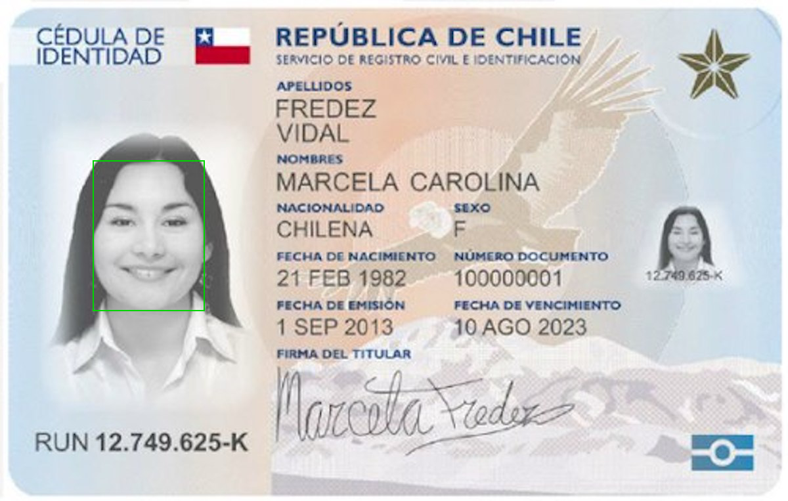
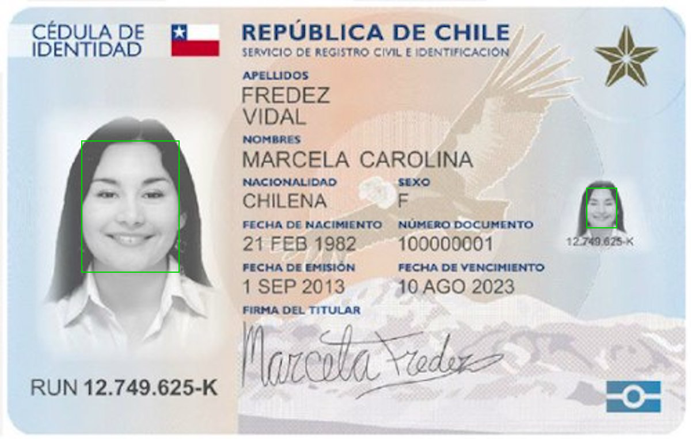
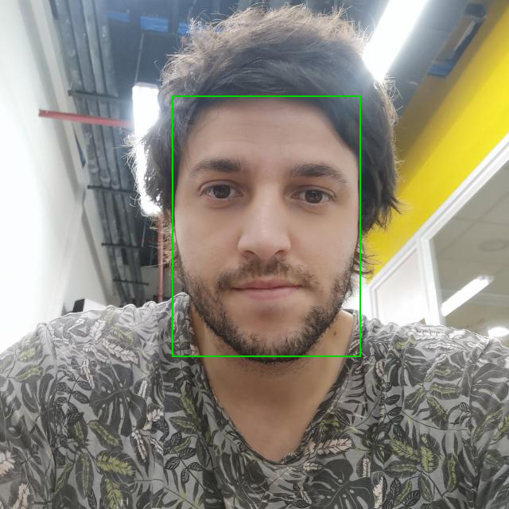

Comparing Faces


```python
import boto3
import io
from PIL import Image, ImageDraw, ExifTags, ImageColor

rekognition_client=boto3.client('rekognition')
s3_resource = boto3.resource('s3')
```


```python
BUCKET ="rekognition-kaufmann-test"
IMG_SOURCE ="dataset-CI/img01.jpg"

s3_object = s3_resource.Object(BUCKET,IMG_SOURCE)
s3_response = s3_object.get()

print(s3_response)

#s3_client = boto3.client('s3')
#BUCKET ="rekognition-kaufmann-test"
#IMG ="dataset-CI/img01.jpg"
#s3_response = s3_client.get_object(Bucket=BUCKET, Key=IMG_SOURCE)
#print(s3_response)
```

    {'ResponseMetadata': {'RequestId': '2V8VK3VS0Q8ZEYYT', 'HostId': 'SK54JMiSthK1pxI3+Fv8MNWHjT1zzG3KRBppHica+G3jwJBvHaAt4uZeNO4PcwdCN9uRm/lCIdI=', 'HTTPStatusCode': 200, 'HTTPHeaders': {'x-amz-id-2': 'SK54JMiSthK1pxI3+Fv8MNWHjT1zzG3KRBppHica+G3jwJBvHaAt4uZeNO4PcwdCN9uRm/lCIdI=', 'x-amz-request-id': '2V8VK3VS0Q8ZEYYT', 'date': 'Wed, 26 Jan 2022 17:13:08 GMT', 'last-modified': 'Wed, 26 Jan 2022 03:00:59 GMT', 'etag': '"0748567a72edd5456bfb1fdc49921714"', 'accept-ranges': 'bytes', 'content-type': 'image/jpeg', 'server': 'AmazonS3', 'content-length': '126520'}, 'RetryAttempts': 0}, 'AcceptRanges': 'bytes', 'LastModified': datetime.datetime(2022, 1, 26, 3, 0, 59, tzinfo=tzutc()), 'ContentLength': 126520, 'ETag': '"0748567a72edd5456bfb1fdc49921714"', 'ContentType': 'image/jpeg', 'Metadata': {}, 'Body': <botocore.response.StreamingBody object at 0x7f5191b4cb38>}


Reconocimiento de caras utilizando detect_faces


```python
response = rekognition_client.detect_faces(Image={'S3Object': {'Bucket': BUCKET, 'Name': IMG_SOURCE}},
    Attributes=['ALL'])
```


```python
response
```


    {'FaceDetails': [{'BoundingBox': {'Width': 0.13990193605422974,
        'Height': 0.3008655607700348,
        'Left': 0.11887595802545547,
        'Top': 0.3201272487640381},
       'AgeRange': {'Low': 22, 'High': 30},
       'Smile': {'Value': True, 'Confidence': 98.63682556152344},
       'Eyeglasses': {'Value': False, 'Confidence': 99.68364715576172},
       'Sunglasses': {'Value': False, 'Confidence': 99.87760162353516},
       'Gender': {'Value': 'Female', 'Confidence': 99.99324035644531},
       'Beard': {'Value': False, 'Confidence': 97.61695861816406},
       'Mustache': {'Value': False, 'Confidence': 99.03800201416016},
       'EyesOpen': {'Value': True, 'Confidence': 89.34935760498047},
       'MouthOpen': {'Value': True, 'Confidence': 92.23059844970703},
       'Emotions': [{'Type': 'HAPPY', 'Confidence': 99.37271881103516},
        {'Type': 'CALM', 'Confidence': 0.13232704997062683},
        {'Type': 'CONFUSED', 'Confidence': 0.1114337220788002},
        {'Type': 'DISGUSTED', 'Confidence': 0.10537903010845184},
        {'Type': 'ANGRY', 'Confidence': 0.0915151834487915},
        {'Type': 'SURPRISED', 'Confidence': 0.0846385583281517},
        {'Type': 'FEAR', 'Confidence': 0.054967090487480164},
        {'Type': 'SAD', 'Confidence': 0.04701363667845726}],
       'Landmarks': [{'Type': 'eyeLeft',
         'X': 0.15677350759506226,
         'Y': 0.441171795129776},
        {'Type': 'eyeRight', 'X': 0.21996425092220306, 'Y': 0.4421303868293762},
        {'Type': 'mouthLeft', 'X': 0.1610795110464096, 'Y': 0.5396367311477661},
        {'Type': 'mouthRight', 'X': 0.21380449831485748, 'Y': 0.540396511554718},
        {'Type': 'nose', 'X': 0.18841014802455902, 'Y': 0.4933047592639923},
        {'Type': 'leftEyeBrowLeft',
         'X': 0.13323593139648438,
         'Y': 0.4176582992076874},
        {'Type': 'leftEyeBrowRight',
         'X': 0.17040453851222992,
         'Y': 0.41117972135543823},
        {'Type': 'leftEyeBrowUp',
         'X': 0.15209640562534332,
         'Y': 0.40581199526786804},
        {'Type': 'rightEyeBrowLeft',
         'X': 0.20640788972377777,
         'Y': 0.4117049276828766},
        {'Type': 'rightEyeBrowRight',
         'X': 0.24274517595767975,
         'Y': 0.4192016124725342},
        {'Type': 'rightEyeBrowUp',
         'X': 0.2246101051568985,
         'Y': 0.4068717956542969},
        {'Type': 'leftEyeLeft',
         'X': 0.14545120298862457,
         'Y': 0.44053810834884644},
        {'Type': 'leftEyeRight', 'X': 0.16919295489788055, 'Y': 0.442108154296875},
        {'Type': 'leftEyeUp', 'X': 0.1566513180732727, 'Y': 0.436047226190567},
        {'Type': 'leftEyeDown',
         'X': 0.15698428452014923,
         'Y': 0.44541841745376587},
        {'Type': 'rightEyeLeft',
         'X': 0.20731747150421143,
         'Y': 0.4426814019680023},
        {'Type': 'rightEyeRight',
         'X': 0.23092679679393768,
         'Y': 0.44180506467819214},
        {'Type': 'rightEyeUp', 'X': 0.2200171947479248, 'Y': 0.4369899332523346},
        {'Type': 'rightEyeDown',
         'X': 0.21948638558387756,
         'Y': 0.44634026288986206},
        {'Type': 'noseLeft', 'X': 0.17602795362472534, 'Y': 0.504531741142273},
        {'Type': 'noseRight', 'X': 0.19925253093242645, 'Y': 0.5048698782920837},
        {'Type': 'mouthUp', 'X': 0.18750257790088654, 'Y': 0.5281059741973877},
        {'Type': 'mouthDown', 'X': 0.18713738024234772, 'Y': 0.5579749941825867},
        {'Type': 'leftPupil', 'X': 0.15677350759506226, 'Y': 0.441171795129776},
        {'Type': 'rightPupil', 'X': 0.21996425092220306, 'Y': 0.4421303868293762},
        {'Type': 'upperJawlineLeft',
         'X': 0.11849284917116165,
         'Y': 0.44249677658081055},
        {'Type': 'midJawlineLeft',
         'X': 0.1307832896709442,
         'Y': 0.5500906109809875},
        {'Type': 'chinBottom', 'X': 0.18646730482578278, 'Y': 0.6098143458366394},
        {'Type': 'midJawlineRight',
         'X': 0.24177497625350952,
         'Y': 0.5516948103904724},
        {'Type': 'upperJawlineRight',
         'X': 0.2555816173553467,
         'Y': 0.4444520175457001}],
       'Pose': {'Roll': 0.660060465335846,
        'Yaw': -0.15182946622371674,
        'Pitch': 5.433718681335449},
       'Quality': {'Brightness': 95.86566162109375,
        'Sharpness': 38.89601135253906},
       'Confidence': 99.99957275390625},
      {'BoundingBox': {'Width': 0.042594604194164276,
        'Height': 0.09157781302928925,
        'Left': 0.8494014739990234,
        'Top': 0.42818087339401245},
       'AgeRange': {'Low': 29, 'High': 39},
       'Smile': {'Value': True, 'Confidence': 97.26824951171875},
       'Eyeglasses': {'Value': False, 'Confidence': 99.43094635009766},
       'Sunglasses': {'Value': False, 'Confidence': 99.76066589355469},
       'Gender': {'Value': 'Female', 'Confidence': 99.9681625366211},
       'Beard': {'Value': False, 'Confidence': 88.92654418945312},
       'Mustache': {'Value': False, 'Confidence': 97.61831665039062},
       'EyesOpen': {'Value': True, 'Confidence': 87.92720794677734},
       'MouthOpen': {'Value': True, 'Confidence': 81.40684509277344},
       'Emotions': [{'Type': 'HAPPY', 'Confidence': 99.94962310791016},
        {'Type': 'SURPRISED', 'Confidence': 0.015289963223040104},
        {'Type': 'FEAR', 'Confidence': 0.007208470720797777},
        {'Type': 'CALM', 'Confidence': 0.006116863340139389},
        {'Type': 'ANGRY', 'Confidence': 0.005721298977732658},
        {'Type': 'DISGUSTED', 'Confidence': 0.005548595916479826},
        {'Type': 'SAD', 'Confidence': 0.005485327914357185},
        {'Type': 'CONFUSED', 'Confidence': 0.005005305167287588}],
       'Landmarks': [{'Type': 'eyeLeft',
         'X': 0.8598533868789673,
         'Y': 0.46292349696159363},
        {'Type': 'eyeRight', 'X': 0.8796805739402771, 'Y': 0.4637874662876129},
        {'Type': 'mouthLeft', 'X': 0.8610855340957642, 'Y': 0.49441730976104736},
        {'Type': 'mouthRight', 'X': 0.8776479363441467, 'Y': 0.49512386322021484},
        {'Type': 'nose', 'X': 0.8697847723960876, 'Y': 0.48032456636428833},
        {'Type': 'leftEyeBrowLeft',
         'X': 0.8524994254112244,
         'Y': 0.45515358448028564},
        {'Type': 'leftEyeBrowRight',
         'X': 0.8642051219940186,
         'Y': 0.45371395349502563},
        {'Type': 'leftEyeBrowUp', 'X': 0.858457624912262, 'Y': 0.4517669379711151},
        {'Type': 'rightEyeBrowLeft',
         'X': 0.8755058646202087,
         'Y': 0.45418864488601685},
        {'Type': 'rightEyeBrowRight',
         'X': 0.8868555426597595,
         'Y': 0.45659372210502625},
        {'Type': 'rightEyeBrowUp',
         'X': 0.8812153935432434,
         'Y': 0.4527253806591034},
        {'Type': 'leftEyeLeft', 'X': 0.8562923073768616, 'Y': 0.46258893609046936},
        {'Type': 'leftEyeRight',
         'X': 0.8637554049491882,
         'Y': 0.46335670351982117},
        {'Type': 'leftEyeUp', 'X': 0.8598263263702393, 'Y': 0.46132776141166687},
        {'Type': 'leftEyeDown', 'X': 0.8599165081977844, 'Y': 0.46430450677871704},
        {'Type': 'rightEyeLeft',
         'X': 0.8757165670394897,
         'Y': 0.46387580037117004},
        {'Type': 'rightEyeRight',
         'X': 0.8831174969673157,
         'Y': 0.4637390375137329},
        {'Type': 'rightEyeUp', 'X': 0.8797106146812439, 'Y': 0.46218401193618774},
        {'Type': 'rightEyeDown',
         'X': 0.8795318603515625,
         'Y': 0.46514567732810974},
        {'Type': 'noseLeft', 'X': 0.8658304810523987, 'Y': 0.48353052139282227},
        {'Type': 'noseRight', 'X': 0.8731270432472229, 'Y': 0.4838316738605499},
        {'Type': 'mouthUp', 'X': 0.86940997838974, 'Y': 0.4911755919456482},
        {'Type': 'mouthDown', 'X': 0.8692402243614197, 'Y': 0.5006499290466309},
        {'Type': 'leftPupil', 'X': 0.8598533868789673, 'Y': 0.46292349696159363},
        {'Type': 'rightPupil', 'X': 0.8796805739402771, 'Y': 0.4637874662876129},
        {'Type': 'upperJawlineLeft',
         'X': 0.8477655053138733,
         'Y': 0.4624667763710022},
        {'Type': 'midJawlineLeft',
         'X': 0.8514439463615417,
         'Y': 0.49688708782196045},
        {'Type': 'chinBottom', 'X': 0.8689123392105103, 'Y': 0.5169360637664795},
        {'Type': 'midJawlineRight',
         'X': 0.8862923979759216,
         'Y': 0.49832186102867126},
        {'Type': 'upperJawlineRight',
         'X': 0.8907806277275085,
         'Y': 0.46425631642341614}],
       'Pose': {'Roll': 0.2105298489332199,
        'Yaw': -0.45373281836509705,
        'Pitch': 5.457488059997559},
       'Quality': {'Brightness': 94.72006225585938,
        'Sharpness': 3.3018569946289062},
       'Confidence': 99.93148040771484}],
     'ResponseMetadata': {'RequestId': 'c759195a-252c-451a-90ad-e58852eb69ed',
      'HTTPStatusCode': 200,
      'HTTPHeaders': {'x-amzn-requestid': 'c759195a-252c-451a-90ad-e58852eb69ed',
       'content-type': 'application/x-amz-json-1.1',
       'content-length': '6717',
       'date': 'Wed, 26 Jan 2022 17:14:16 GMT'},
      'RetryAttempts': 0}}


```python
s3_object = s3_resource.Object(BUCKET,IMG_SOURCE)
s3_response = s3_object.get()
stream = io.BytesIO(s3_response['Body'].read())
image=Image.open(stream)
imgWidth, imgHeight = image.size  
draw = ImageDraw.Draw(image)  
      
print('Caras detectadas para ' + IMG_SOURCE)    
for faceDetail in response['FaceDetails']:
    print('La edad de la cara detectada esta entre ' + str(faceDetail['AgeRange']['Low']) 
          + ' y ' + str(faceDetail['AgeRange']['High']) + ' años')

    box = faceDetail['BoundingBox']
    left = imgWidth * box['Left']
    top = imgHeight * box['Top']
    width = imgWidth * box['Width']
    height = imgHeight * box['Height']

    print('Left: ' + '{0:.0f}'.format(left))
    print('Top: ' + '{0:.0f}'.format(top))
    print('Face Width: ' + "{0:.0f}".format(width))
    print('Face Height: ' + "{0:.0f}".format(height))

    points = (
        (left,top),
        (left + width, top),
        (left + width, top + height),
        (left , top + height),
        (left, top)

    )
    draw.line(points, fill='#00d400', width=2)

image.show()
```

    Caras detectadas para dataset-CI/img01.jpg
    La edad de la cara detectada esta entre 22 y 30 años
    Left: 143
    Top: 244
    Face Width: 168
    Face Height: 230
    La edad de la cara detectada esta entre 29 y 39 años
    Left: 1019
    Top: 327
    Face Width: 51
    Face Height: 70


Caras Iguales


```python
IMG_SOURCE ="dataset-CI/img01.jpg"
IMG_TARGET ="dataset-CI/img01.jpg"
response = rekognition_client.compare_faces(
                SourceImage={
                    'S3Object': {
                        'Bucket': BUCKET,
                        'Name': IMG_SOURCE
                    }
                },
                TargetImage={
                    'S3Object': {
                        'Bucket': BUCKET,
                        'Name': IMG_TARGET                    
                    }
                }
)
```


```python
response
```


    {'SourceImageFace': {'BoundingBox': {'Width': 0.13990193605422974,
       'Height': 0.3008655607700348,
       'Left': 0.11887595802545547,
       'Top': 0.3201272487640381},
      'Confidence': 99.99957275390625},
     'FaceMatches': [{'Similarity': 100.0,
       'Face': {'BoundingBox': {'Width': 0.13990193605422974,
         'Height': 0.3008655607700348,
         'Left': 0.11887595802545547,
         'Top': 0.3201272487640381},
        'Confidence': 99.99957275390625,
        'Landmarks': [{'Type': 'eyeLeft',
          'X': 0.15677350759506226,
          'Y': 0.441171795129776},
         {'Type': 'eyeRight', 'X': 0.21996425092220306, 'Y': 0.4421303868293762},
         {'Type': 'mouthLeft', 'X': 0.1610795110464096, 'Y': 0.5396367311477661},
         {'Type': 'mouthRight', 'X': 0.21380449831485748, 'Y': 0.540396511554718},
         {'Type': 'nose', 'X': 0.18841014802455902, 'Y': 0.4933047592639923}],
        'Pose': {'Roll': 0.660060465335846,
         'Yaw': -0.15182946622371674,
         'Pitch': 5.433718681335449},
        'Quality': {'Brightness': 95.86566162109375,
         'Sharpness': 38.89601135253906}}},
      {'Similarity': 80.1844482421875,
       'Face': {'BoundingBox': {'Width': 0.042594604194164276,
         'Height': 0.09157781302928925,
         'Left': 0.8494014739990234,
         'Top': 0.42818087339401245},
        'Confidence': 99.93148040771484,
        'Landmarks': [{'Type': 'eyeLeft',
          'X': 0.8598533868789673,
          'Y': 0.46292349696159363},
         {'Type': 'eyeRight', 'X': 0.8796805739402771, 'Y': 0.4637874662876129},
         {'Type': 'mouthLeft', 'X': 0.8610855340957642, 'Y': 0.49441730976104736},
         {'Type': 'mouthRight', 'X': 0.8776479363441467, 'Y': 0.49512386322021484},
         {'Type': 'nose', 'X': 0.8697847723960876, 'Y': 0.48032456636428833}],
        'Pose': {'Roll': 0.2105298489332199,
         'Yaw': -0.45373281836509705,
         'Pitch': 5.457488059997559},
        'Quality': {'Brightness': 94.72006225585938,
         'Sharpness': 3.3018569946289062}}}],
     'UnmatchedFaces': [],
     'ResponseMetadata': {'RequestId': 'd855a5af-31dc-4d87-a150-a9c50892f6c6',
      'HTTPStatusCode': 200,
      'HTTPHeaders': {'x-amzn-requestid': 'd855a5af-31dc-4d87-a150-a9c50892f6c6',
       'content-type': 'application/x-amz-json-1.1',
       'content-length': '1607',
       'date': 'Wed, 26 Jan 2022 17:15:56 GMT'},
      'RetryAttempts': 0}}


```python
# Analisis imagen source
s3_object = s3_resource.Object(BUCKET,IMG_SOURCE)
s3_response = s3_object.get()
stream = io.BytesIO(s3_response['Body'].read())
image=Image.open(stream)
imgWidth, imgHeight = image.size  
draw = ImageDraw.Draw(image)  

box = response['SourceImageFace']['BoundingBox']
left = imgWidth * box['Left']
top = imgHeight * box['Top']
width = imgWidth * box['Width']
height = imgHeight * box['Height']

print('Left: ' + '{0:.0f}'.format(left))
print('Top: ' + '{0:.0f}'.format(top))
print('Face Width: ' + "{0:.0f}".format(width))
print('Face Height: ' + "{0:.0f}".format(height))

points = (
    (left,top),
    (left + width, top),
    (left + width, top + height),
    (left , top + height),
    (left, top)

)
draw.line(points, fill='#00d400', width=2)

image.show()
```

    Left: 143
    Top: 244
    Face Width: 168
    Face Height: 230





```python
# Analisis imagen target
s3_object = s3_resource.Object(BUCKET,IMG_TARGET)
s3_response = s3_object.get()
stream = io.BytesIO(s3_response['Body'].read())
image=Image.open(stream)
imgWidth, imgHeight = image.size  
draw = ImageDraw.Draw(image)  
for face in response['FaceMatches']:
    face_match = face['Face']
    box = face_match['BoundingBox']
    left = imgWidth * box['Left']
    top = imgHeight * box['Top']
    width = imgWidth * box['Width']
    height = imgHeight * box['Height']

    print('Left: ' + '{0:.0f}'.format(left))
    print('Top: ' + '{0:.0f}'.format(top))
    print('Face Width: ' + "{0:.0f}".format(width))
    print('Face Height: ' + "{0:.0f}".format(height))

    points = (
        (left,top),
        (left + width, top),
        (left + width, top + height),
        (left , top + height),
        (left, top)

    )
    draw.line(points, fill='#00d400', width=2)

image.show()
```

    Left: 143
    Top: 244
    Face Width: 168
    Face Height: 230
    Left: 1019
    Top: 327
    Face Width: 51
    Face Height: 70





Caras Distintas


```python
IMG_SOURCE ="dataset-CI/imgsource.jpg"
IMG_TARGET ="dataset-CI/img20.jpg"
response = rekognition_client.compare_faces(
                SourceImage={
                    'S3Object': {
                        'Bucket': BUCKET,
                        'Name': IMG_SOURCE
                    }
                },
                TargetImage={
                    'S3Object': {
                        'Bucket': BUCKET,
                        'Name': IMG_TARGET                    
                    }
                }
)
```


```python
response
```


    {'SourceImageFace': {'BoundingBox': {'Width': 0.3676206171512604,
       'Height': 0.5122320055961609,
       'Left': 0.33957839012145996,
       'Top': 0.18869829177856445},
      'Confidence': 99.99957275390625},
     'FaceMatches': [{'Similarity': 99.99634552001953,
       'Face': {'BoundingBox': {'Width': 0.14619407057762146,
         'Height': 0.26241832971572876,
         'Left': 0.13103649020195007,
         'Top': 0.40437373518943787},
        'Confidence': 99.99955749511719,
        'Landmarks': [{'Type': 'eyeLeft',
          'X': 0.17260463535785675,
          'Y': 0.5030772089958191},
         {'Type': 'eyeRight', 'X': 0.23902645707130432, 'Y': 0.5023221969604492},
         {'Type': 'mouthLeft', 'X': 0.17937719821929932, 'Y': 0.5977044105529785},
         {'Type': 'mouthRight', 'X': 0.23477530479431152, 'Y': 0.5970458984375},
         {'Type': 'nose', 'X': 0.20820103585720062, 'Y': 0.5500822067260742}],
        'Pose': {'Roll': 0.4675966203212738,
         'Yaw': 1.592366099357605,
         'Pitch': 8.6331205368042},
        'Quality': {'Brightness': 85.35185241699219,
         'Sharpness': 89.85481262207031}}}],
     'UnmatchedFaces': [],
     'ResponseMetadata': {'RequestId': '3ae9032d-de8a-41ef-b22f-f95c70eed783',
      'HTTPStatusCode': 200,
      'HTTPHeaders': {'x-amzn-requestid': '3ae9032d-de8a-41ef-b22f-f95c70eed783',
       'content-type': 'application/x-amz-json-1.1',
       'content-length': '911',
       'date': 'Wed, 26 Jan 2022 17:21:53 GMT'},
      'RetryAttempts': 0}}


```python
# Analisis imagen source
s3_object = s3_resource.Object(BUCKET,IMG_SOURCE)
s3_response = s3_object.get()
stream = io.BytesIO(s3_response['Body'].read())
image=Image.open(stream)
imgWidth, imgHeight = image.size  
draw = ImageDraw.Draw(image)  

box = response['SourceImageFace']['BoundingBox']
left = imgWidth * box['Left']
top = imgHeight * box['Top']
width = imgWidth * box['Width']
height = imgHeight * box['Height']

print('Left: ' + '{0:.0f}'.format(left))
print('Top: ' + '{0:.0f}'.format(top))
print('Face Width: ' + "{0:.0f}".format(width))
print('Face Height: ' + "{0:.0f}".format(height))

points = (
    (left,top),
    (left + width, top),
    (left + width, top + height),
    (left , top + height),
    (left, top)

)
draw.line(points, fill='#00d400', width=2)

image.show()
```

    Left: 217
    Top: 121
    Face Width: 235
    Face Height: 328





```python
# Analisis imagen target
s3_object = s3_resource.Object(BUCKET,IMG_TARGET)
s3_response = s3_object.get()
stream = io.BytesIO(s3_response['Body'].read())
image=Image.open(stream)
imgWidth, imgHeight = image.size  
draw = ImageDraw.Draw(image)
if len(response['UnmatchedFaces']) > 0:
    for face in response['UnmatchedFaces']:
        box = face['BoundingBox']
        left = imgWidth * box['Left']
        top = imgHeight * box['Top']
        width = imgWidth * box['Width']
        height = imgHeight * box['Height']
        print('UnmatchedFaces')
        print('Left: ' + '{0:.0f}'.format(left))
        print('Top: ' + '{0:.0f}'.format(top))
        print('Face Width: ' + "{0:.0f}".format(width))
        print('Face Height: ' + "{0:.0f}".format(height))

        points = (
            (left,top),
            (left + width, top),
            (left + width, top + height),
            (left , top + height),
            (left, top)

        )
        draw.line(points, fill='#ff0000', width=2)
        
if len(response['FaceMatches']) > 0:
    for face in response['FaceMatches']:
        face_match = face['Face']
        box = face_match['BoundingBox']
        left = imgWidth * box['Left']
        top = imgHeight * box['Top']
        width = imgWidth * box['Width']
        height = imgHeight * box['Height']
        print('FaceMatches')
        print('Left: ' + '{0:.0f}'.format(left))
        print('Top: ' + '{0:.0f}'.format(top))
        print('Face Width: ' + "{0:.0f}".format(width))
        print('Face Height: ' + "{0:.0f}".format(height))

        points = (
            (left,top),
            (left + width, top),
            (left + width, top + height),
            (left , top + height),
            (left, top)

        )
        draw.line(points, fill='#00d400', width=2)        
image.show()
```

    FaceMatches
    Left: 671
    Top: 1553
    Face Width: 749
    Face Height: 1008


```python

```
